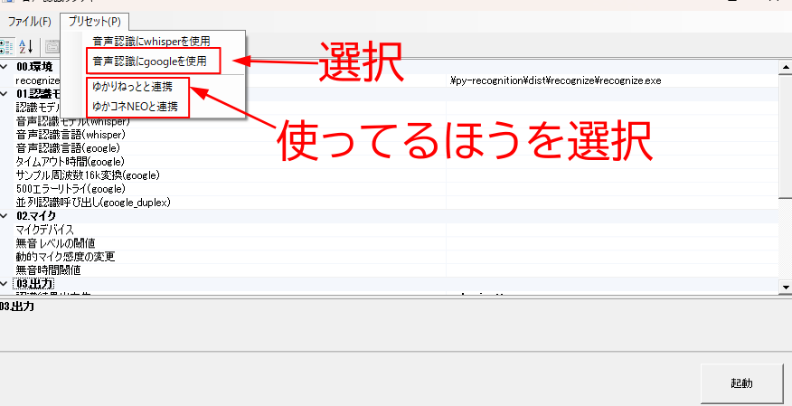
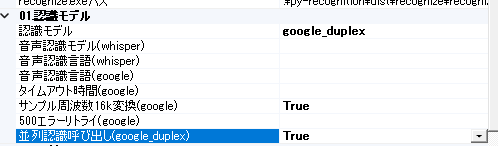
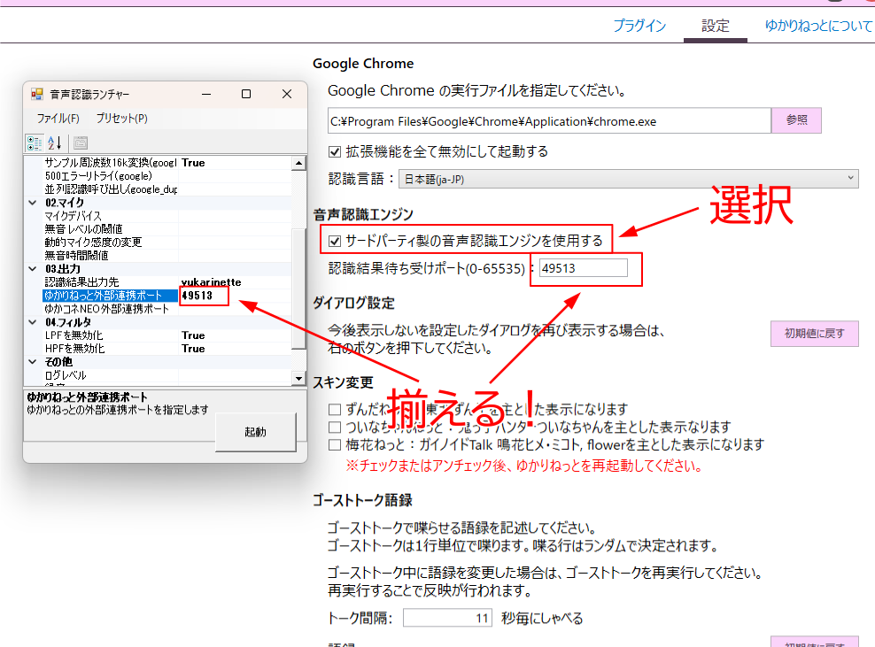

# 簡単スタート

## まずビルド！
最初にexeファイルを作る必要があります。  
ダウンロードしたZIPファイルを解凍すると中にbuild-all.batがあるのでダブルクリックで実行します。結構時間かかる！  
※この作業はアップデートした場合再度行う必要があります。  
途中pythonとgitのインストールを尋ねられることがあります。この場合インストールしてください。

batファイルのウインドウは適当にキーを押せば閉じます。

## 認識する準備！
recognize-gui.exeをダブルクリックで実行します。  
プリセットから簡易設定を行いましょう。

### google_duplexおすすめ設定！(2024/02/08時点)
並列呼び出しをTrueにしておくと認識失敗がへりますよ！

### \[ゆかりねっと限定\]外部連携の設定！

※ゆかコネNEOは自動で連携するので通常必要ありません

## マイクの調整！
なうわーきんぐ
