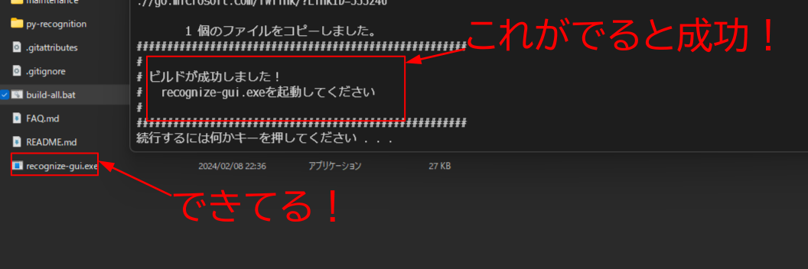
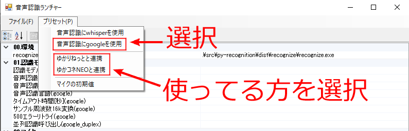
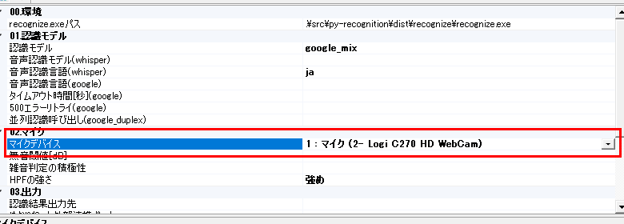
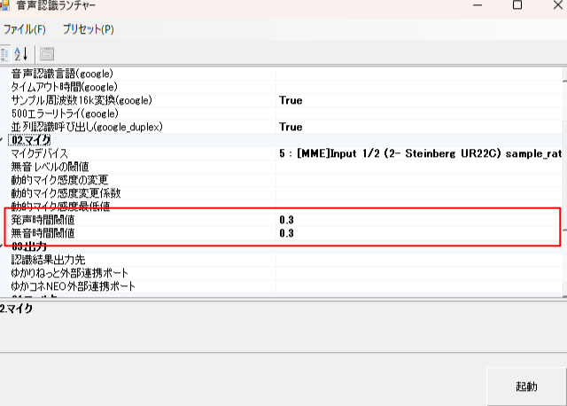
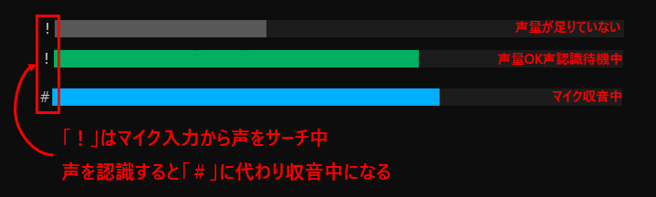
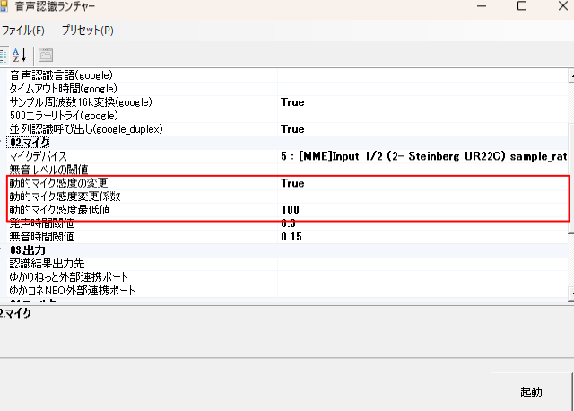

# 簡単スタート

## まずビルド！
最初にexeファイルを作る必要があります。  
ダウンロードしたZIPファイルを解凍すると中にbuild-all.batがあるのでダブルクリックで実行します。結構時間かかる！  
※この作業はアップデートした場合再度行う必要があります。  
※ビルド時exeを作成する都合上、4～5Gほど容量を使用します。実行するドライブの容量にお気を付けください。
途中pythonのインストールを尋ねられることがあります。この場合インストールしてください。

batファイルのウインドウは適当にキーを押せば閉じます。

## 認識する準備！
recognize-gui.exeをダブルクリックで実行します。  
プリセットから簡易設定を行いましょう。

### google_duplexおすすめ設定！(2024/02/08時点)
並列呼び出しをTrueにしておくと認識失敗がへりますよ！

### \[ゆかりねっと限定\]外部連携の設定！

※ゆかコネNEOは自動で連携するので通常必要ありません

## マイクの調整！

ここから文字がたくさんですが頑張りましょう…！

### マイクデバイスの選択！
マイクデバイスをプルダウンすると接続されている入力デバイスの一覧が並ぶので使っているものを選択します。同じデバイスが複数見えますが認識に使用するOSの方法が異なります。\[MME\]と\[WASAPI\]での動作を確認していますよ！  
このデバイスは出力含むサウンドデバイスに変更があると順序が変わり再度選択する必要があるのでDACなど抜き差ししている人は特に注意してください！

※文字化けしているのは使用しているコンポーネントの問題のため現時点では仕様です

### 最低音声認識時間と発声を止めたと認識するための無音時間の設定！
いきなり難しそうなタイトルですがとりあえず、  
発声時間閾値 = 0.3  
無音時間閾値 = 0.3  
に設定しましょう！  
この解説は下段でやります！

### まず認識テスト！
メニューからマイクテストを実施します。

どうですか？しゃべり終わったタイミングで認識が終了しましたか？ここで遅れが発生する、または早く終了する場合は次の\[無音レベルの閾値調整！\]に進みます。問題がない場合は次節はスキップして問題ありません。

どういう音が認識しているか確認したい場合カテゴリそのほかにある\[録音\]をTrueにしてテストを実行すると認識した音声データをwavファイルを保存します。これを聞いて無駄がないか確認しましょう！  
※ このオプションはゆかりねっと連携時も有効でwavで保存するので必要ない場合はFalseに設定して録音されないようにしましょう

### (この説明の単語、画面は過去のものです)無音レベルの閾値調整！
無音レベルの閾値はマイクが音を拾う最低の値です。  

なにも設定されていないと内部で300が設定されています。この適正な値は使用しているマイクによってことなるのでお使いの環境に合わせて調整する必要があります。  
雑音を拾って認識が終わらない場合は300より高い値に設定します。  
逆にしゃべっているのに認識が終わる場合は300では感度が高すぎるので低い値に設定します。    
設定したら再度マイクテストを実施して適正な値になるように調整を繰り返します。ここをしっかり設定することで認識精度に差が出るのでしっかりと設定してください…！

### 認識のギリギリを攻める…！
\[発声時間閾値\]と\[無音時間閾値\]の話に戻りますが、何か\[発声時間閾値\]秒以上発声したのち\[無音時間閾値\]秒黙っていると有効な発声データとして取り扱います。そのためこの値はどちらも小さいほうが認識のレスポンスがよくなります。ただし、\[発声\]と\[雑音\]は区別できないため小さくしすぎるととっさに発生したノイズで後続のgoogle音声認識に送ることになるのでそれが終わるまで次のgoogle音声認識を待つことになります。できるだけ小さくしかし小さすぎない値を設定する必要があるのです…！

参考までに制作側は  
発声時間閾値 = 0.3  
無音時間閾値 = 0.15  
を設定していますよ。

### \[オプション\]_(この説明の単語、画面は過去のものです)動的マイク感度の変更の設定…する？
\[動的マイク感度の変更\]は周囲の騒音レベルに応じてマイク感度を動的に変更する機能です。使っているコンポーネントの説明ではスタジオでもないかぎり騒音はコントロールされていないのでこのオプションをTrueにすることが推奨されています。

しかしこのアプリは常時認識処理を行っているため発声していないときもマイク感度の変更が発生しています。そのため離席などで黙っていてもマイク感度が動くのでマイク感度が必要以上に下がってしまうケースがあります。\[動的マイク感度最低値\]に最低になるマイク感度を設定できます。\[動的マイク感度の変更\]をTrueにして無駄な音を拾うようになる場合この\[動的マイク感度最低値\]を変更してください。  
制作側は無効にしていますが国道沿いなど普段から騒音が激しいなどの住環境によっては有効にしたほうがよいかもしれません。

また\[動的マイク感度の変更\]を有効にしてない場合でも起動時の騒音に合わせて一度だけマイク感度の調整を行います。マイク感度を100未満(未指定の時に設定される初期値)に下げる必要がある方はここの値を設定してください。

## recognizeで認識してゆかりねっとでしゃべらせる！
これで準備ができたのでいよいよゆかりねっとでボイロ(等)にしゃべらせましょう。
1. まずゆかりねっとで認識を開始します
2. 起動ボタンをクリックしてrecognize本体を起動します
3. 認識中の表示が出たらなにかしゃべってみます
4. それに合わせてボイロがしゃべる…！

どうですか？問題なく動きましたか？設定はここまでです。お疲れさまでした…！  
設定は保存されるので次回からは起動ボタンだけでOKですよ！