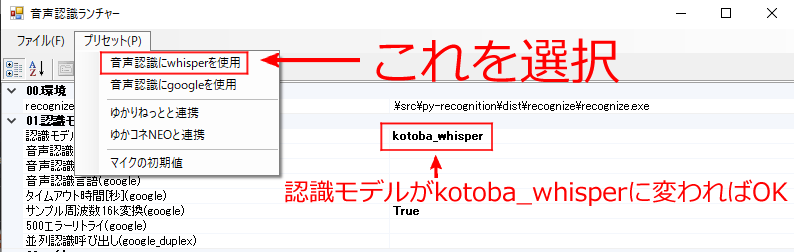
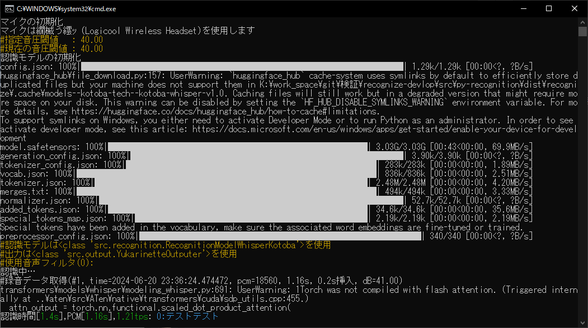

# 認識モデルkotoba_whisper

ゆーかねすぴこれの認識モデルにkotoba_whisperが追加されました！（2024/06/23）  
音声認識をgoogleに依存せずPCで完結する為、言葉詰まりが発声しません。  

注意点もあります。  
・認識モデルをPCに展開するため、ゆーかねすぴこれの合計容量10Gほどになります。  
・GPUのメモリを1～2Gほど使います。  
・googleとは認識モデルが違う為、今までと同じ発音でも違う言葉として認識される可能性があります。  
・ノイズも強制的になんらかの言葉に変換するためゆーかねすぴこれに渡す前にマイクやソフトの機能でノイズキャンセルしてください。  

## 使い方
超簡単です。  
音声認識ランチャーのプリセットから「音声認識にwhisperを使用」を選択して起動するだけです。  
プリセット選択後、認識モデルがkotoba_whisperになってればOKです。    
その他の設定については既存のgoogleを使っている方を前提としている為、割愛させていただきます。  

初回起動時、必要なデータをダウンロードするため、以下のような画面になります。  
ダウンロードが終わり起動までに少しだけ時間が掛かります。  

あとはいつも通りマイクを通して喋ってみてください！  
