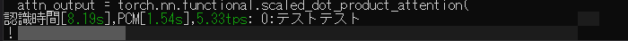
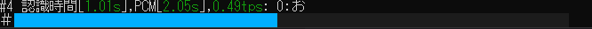

# 最近の大きな更新

## 新しいマイクの認識エンジン(2024/08/04)

マイクの認識処理が大きく変更され設定するパラメータが大きく減りました！以前より簡単に音声認識を開始できます！  
ただなにも設定しないとノイズを拾ってしまうので無音閾値を設定しましょう！  
詳しくは[簡単スタート](KANTAN.md)を！

## マイクのインジケータにより音量レベルを可視化(2024/08/04)

コンソールにマイクの音量レベルが表示されるようになりました！インジケータの色は3色あり、  
灰色 => 未認識  
緑色 => 声を認識可能の音量が出ている  
水色 => 認識中  
になっております！

例  
灰色  
  

緑色  
  

青色  
  

## その他
ランチャーにアイコンが付くようになりました！