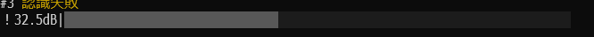

# 最近の大きな更新

## マイクインジケータに現在のdBを表示(2024/08/17)

現在のdB値を表示して環境音境界値(旧：無音閾値)の設定がより便利になりました！

## 冒とくフィルタの導入(2024/08/17)

ゆかりねっと公式認識エンジンで使用されている攻撃的屋卑猥な文字などにフィルタをかける冒とくフィルタが導入されました！(注：google系でのみ使用可能です！)うっかり危険な変換をされても安心な配信が可能です！

## その他(2024/08/04)
- kotoba_whisperが1.1に更新されました！
- ダウンロードされたAIファイルの保存場所が変更され上書き更新時に削除されなくなりました！
- ランチャーウインドウのアイコンがゆーかねすぴれこのものになりました！

## 新しいマイクの認識エンジン(2024/08/04)

マイクの認識処理が大きく変更され設定するパラメータが大きく減りました！以前より簡単に音声認識を開始できます！  
ただなにも設定しないとノイズを拾ってしまうので無音閾値を設定しましょう！  
詳しくは[簡単スタート](KANTAN.md)を！

## マイクのインジケータにより音量レベルを可視化(2024/08/04)

コンソールにマイクの音量レベルが表示されるようになりました！インジケータの色は3色あり、  
灰色 => 未認識  
緑色 => 声を認識可能の音量が出ている  
水色 => 認識中  
になっております！

例  
灰色  
  

緑色  
  

青色  
  

## その他(2024/08/04)
ランチャーにアイコンが付くようになりました！